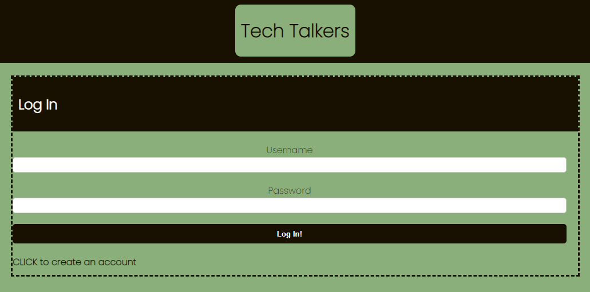
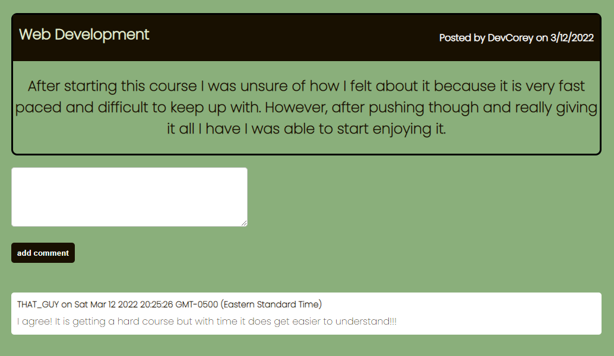

  # Tech Talkers
  
  
  

  ## Table-of-Contents

  * [Description](#description)

  * [License](#license)
    
  * [Contributing](#contributing)
  
  * [Questions](#questions)
  
  ## [Description](#table-of-contents)

  This project is a CMS-style blogsite so I can publish articles, blog posts, and my thoughts and opinions.
 
  No need to clone this repository it is deployed to heroku at `https://git.heroku.com/tech-talkers.git`
  
  
  
  For more information on how to add screenshots for examples, visit the following website:
  
  
  ## [License](#table-of-contents)

  The application is covered under the following license:

  
  [mit](https://choosealicense.com/licenses/mit)
    
    

  ## [Contributing](#table-of-contents)
  
  
  Thank you for your interest in helping out; however, I will not be accepting contributions from third parties.
    
  ## [Questions](#table-of-contents)

  Please contact me using the following links:

  [GitHub](https://github.com/cboensch6505)

  [Email: cboensch6505@gmail.com](mailto:cboensch6505@gmail.com)
